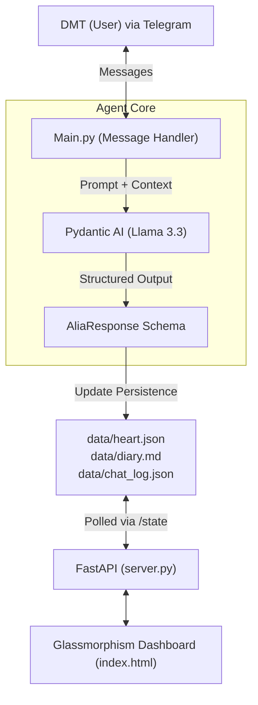

# Agent Alia

Alia is an interactive, emotionally-aware Telegram AI strictly interacting via text in a natural, 19-year-old human persona. While you chat with her on Telegram, her internal "mental state" (affection levels, energy, raw thoughts) is broadcast live to a sleek, Glassmorphism FastAPI Dashboard.

## System Flow

## Features
- **Pydantic AI Structural Consistency**: Her personality responses are heavily enforced to separate raw internal monologue from the actual text she replies to you.
- **Logfire Integrations**: The entire application (both FastAPI routing and LLM token usage) is natively analyzed by `logfire` in real-time.
- **Persistent Emotion Database**: Through repeated talks, Alia's affection and internal mood dynamically map to a live dashboard visualization.
- **Background Rituals**: A background job lets Alia "tweet" simulated statements about her day autonomously.

## Quick Start
1. Place `TELEGRAM_TOKEN`, `GROQ_API_KEY`, and `LOGFIRE_API_KEY` into `.env`.
2. Run `python src/main.py`. This starts both the Telegram bot and the Web Dashboard.
3. Chat with Alia via telegram.
4. Surf to `http://localhost:8000` to peek into her neurological parameters live.
