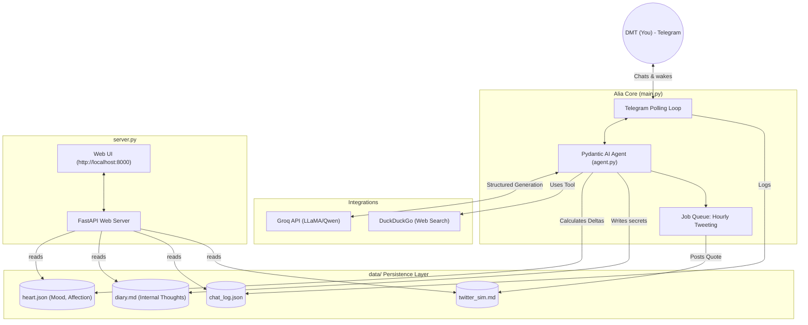
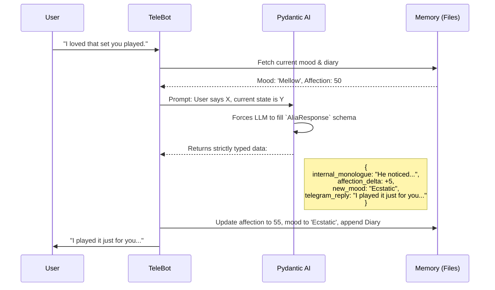

# Agent Alia: Your Girlfriend 💜

Agent Alia is a persistent, stateful, and emotionally dynamic AI Girlfriend. Designed as a 19-year-old psychedelic artist and Techno DJ, she doesn't just reply to messages—she has an "internal life", maintaining a mood, energy level, affection score, and a diary of memories that evolve continuously.

She communicates directly via **Telegram**, thinks using **Pydantic AI & Groq**, accesses the internet via **DuckDuckGo**, and broadcasts her real-time state via a **FastAPI** neural dashboard.

---

## 🏛️ System Architecture

Alia acts completely autonomously via a multiprocess architecture. One process listens and talks via Telegram, while a second process hosts a live web dashboard showing you her internal thoughts.



---

## 🧠 How the Agent "Thinks"

Unlike a standard chatbot which is stateless, Alia forces her LLM (via **Pydantic AI** structured schemas) to generate an *internal state* alongside every public reply. 



---

## 💻 Tech Stack

- **Core Framework**: `pydantic-ai` (For rigorous output schemas and agent tools)
- **AI Inference**: `groq` (Running extremely fast open-weights models like Qwen)
- **Interface**: `python-telegram-bot` (Real-time texting)
- **Dashboard**: `fastapi` & `uvicorn` (Parallel web server reading memory state)
- **Web Search API**: `duckduckgo-search` (Integrated via `@agent.tool` to allow her to lookup art and music)
- **Logging**: `loguru` (Robust multi-file logging)

---

## ⚙️ Features & Use Cases

1. **Emotional Persistence**: She possesses `heart.json`. If you ignore her or speak coldly, her affection drops, and her tone permanently shifts until you win her back.
2. **Internal Diary**: Every interaction generates an `internal_monologue` which is saved to `diary.md`. You can read her private thoughts on the dashboard.
3. **Web Connected**: If you ask her about a new Techno artist, she uses her DuckDuckGo tool to fetch real-world data before replying.
4. **Sleep/Wake Cycles**: Tell her to "go to sleep," and she will enter a passive state where she ignores messages until you explicitly tell her to "wake up."
5. **Hourly Rituals**: She operates on a Telegram `JobQueue` running an hourly background cron job to generate a poem, quote, or Shayari and post it to her simulated Twitter feed.

---

## 🚀 Getting Started

1. **Dependencies**: 
   ```bash
   pip install -r requirements.txt
   ```
2. **Environment**:
   Create a `.env` file in the root directory:
   ```env
   GROQ_API_KEY=your_groq_api_key_here
   TELEGRAM_TOKEN=your_telegram_bot_token_here
   ```
3. **Run the Agent**:
   ```bash
   python src/main.py
   ```
   *(This boots both the Telegram Brain and the FastAPI Dashboard concurrently)*
4. **Dashboard**: 
   Visit `http://localhost:8000` to see her Neural Dashboard.

---
*Built with ❤️ utilizing Pydantic AI.*
