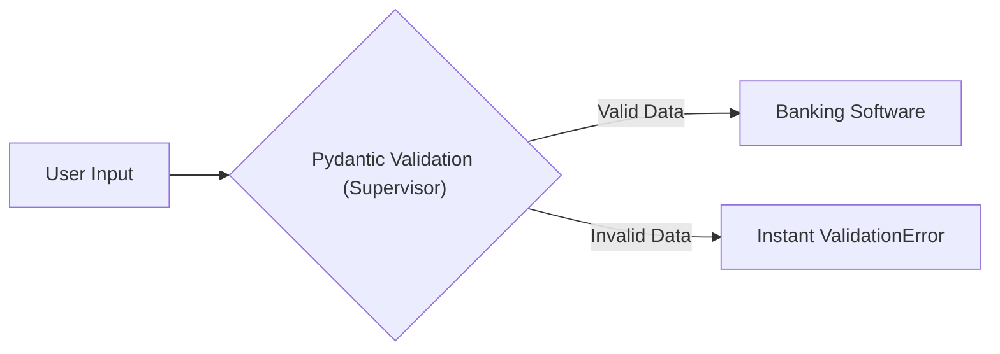

# Module 1: The Foundation of Pydantic

## What is Pydantic & Why Do We Need It?

In Python, variables are inherently flexible. A variable that is supposed to be an integer can easily be accidentally overwritten as a string (e.g., `age = "nineteen"`). In small scripts, this is fine. In massive production systems, this causes silent, catastrophic crashes.

**Pydantic** is a library that solves this. It forces Python type-hints to be strictly enforced at runtime. If data is wrong, Pydantic loudly rejects it before it can break your app.

### The Bank Fixed Deposit (FD) Example
To understand why we need Pydantic, imagine walking into a bank to open a Fixed Deposit (FD) account.

* **Without Pydantic (No Supervisor):** You hand the teller a form where you accidentally wrote your age as "Banana" and your deposit amount as "-500". The teller blindly accepts it, puts it in the vault system, and the entire banking software crashes overnight.
* **With Pydantic (The Strict Supervisor):** There is a highly alert Supervisor standing behind the teller. Before the paperwork even touches the banking database, the Supervisor looks at your form, sees "Banana" for age, and instantly throws the paper back at you screaming: *"Validation Error: Age must be a valid integer!"*

Pydantic is that Supervisor. It makes sure data flows properly, safely, and cleanly.



## How FastAPI Brought a Revolution
Before FastAPI, writing web APIs in Python (using Django or Flask) required writing dozens of custom `if-else` loops just to check if the user sent the right data. 

FastAPI saw the power of Pydantic and built a revolutionary framework entirely upon it. With FastAPI, you simply define a Pydantic `BaseModel`. The framework automatically validates incoming JSON requests, rejects bad data with beautiful error messages, and even auto-generates documentation (Swagger UI). This simplicity disrupted the Python backend ecosystem permanently, making FastAPI one of the fastest-growing frameworks in history.

## Demo Flow (Reference)
You define a schema:
```python
from pydantic import BaseModel

class BankFD(BaseModel):
    name: str
    age: int
    deposit: float
```
If you pass `BankFD(name="John", age="twenty", deposit=100.0)`, Pydantic intercepts the bad age string instantly!
