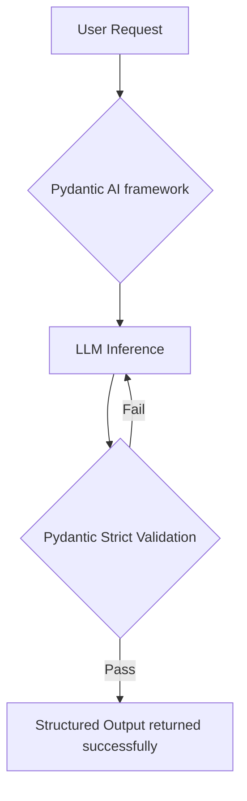

# Module 2: Introduction to Pydantic AI

## What is Pydantic AI?

As Large Language Models (LLMs) exploded in popularity, developers needed a way to force AI models to reply in structured, predictable JSON objects instead of messy paragraphs of text. 

To achieve this, every major AI framework (like LangChain, LlamaIndex, etc.) started heavily relying on **Pydantic** under the hood. The creators of Pydantic realized: *"If everyone is using our validation library to build AI agents, why don't we just build the most optimized, native AI framework ourselves?"*

And thus, **Pydantic AI** was born—a framework natively integrated with Pydantic routing, eliminating the bloated middleware of older frameworks.

## AI Agents: A Digital Human
Think of an AI Agent as a **Digital Human**. 
- **The Brain**: The LLM (like GPT-4 or Llama-3) is the brain. It thinks, reasons, and knows a lot of things.
- **The Hands**: Tools. A brain without hands cannot interact with the world. Tools allow the brain to search the web or write files.
- **The Guardrails**: Pydantic validations ensure the Digital Human doesn't go crazy and output hallucinated formats.

### Why using just the "Brain" (LLM) isn't enough?
If you just use a raw LLM, you are talking to a brain floating in a jar. It can answer questions based on its training data, but:
1. It doesn't know what time it is currently.
2. It cannot browse the internet to find out who won yesterday's football game.
3. It often rambles in unstructured text.
We put validations and tools around the LLM so it can actually *do tangible work* in the real world.

## Frameworks Comparison

Integrating Logfire with Pydantic AI is native, making it an incredible choice for production-grade, observable AI.

| Feature | Pydantic AI | LangChain | Crew AI | Open AI (Raw API) |
| :--- | :--- | :--- | :--- | :--- |
| **Primary Focus** | Static schema validation, Type-safety, Fast execution | Massive ecosystem of chains, Prompts, and APIs | Multi-agent orchestration, Agents talking to Agents | Direct API chatting, pure inference |
| **Complexity to Learn** | Very Low (Native Python syntax) | High (Learning curve is steep, many abstractions) | Medium (Focuses on roles and delegation) | Low |
| **Output Reliability**| Extremely High (Pydantic Supervisor natively forces schema) | Medium (Requires parsing retries) | Medium | Requires strict prompting |
| **Observability** | **Native Logfire Tracing** (1-line integration) | LangSmith (Heavy setup) | Custom integrations needed | Custom scripts needed |
| **Best Used For** | Building stable, predictable, production-ready AI tools | Rapid prototyping with hundreds of random plugins | Building a team of simulated AI workers to solve a complex puzzle | Building your own framework from scratch |

