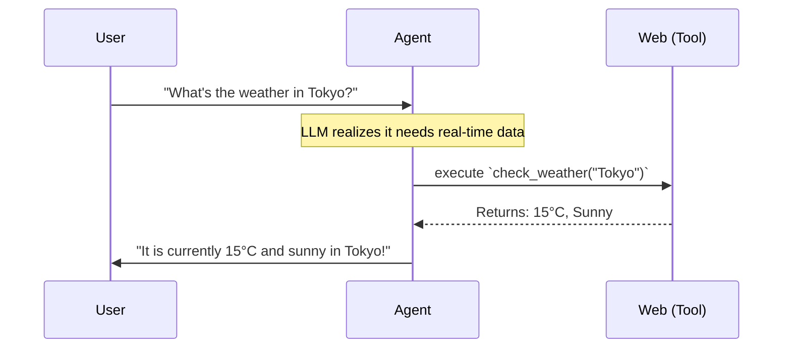

# Module 3: Tools and External Intelligence

## What are Tools?
An LLM inherently is locked inside its training data. If an LLM was trained in 2023, it has absolutely no idea what is happening today. 

**Tools** are quite literally scripts or API connections that you feed to the LLM. 
When the LLM encounters a question it cannot answer automatically, it can pause, say *"Hey system, please run this Tool for me"*, read the result, and then construct a final, educated answer.

### How do they enhance output?
By giving an Agent a "Check the Weather" tool, the Agent transforms from a simple chatbot into a dynamic weather assistant. It replaces hallucinations with hard data.

## The Role of Pydantic AI with Tool Calling
Pydantic AI shines brightly here. It uses your tool's native Python docstrings and parameter type-hints to automatically format instructions for the LLM. You don't have to write massive JSON schemas to define a tool—you literally just write a basic Python function and slap `@agent.tool` on it.

## Types of Tools

1. **Custom Tools**: Functions you write from scratch. (e.g., A tool that connects to your specific custom SQL database or a local file reader).
2. **Built-in Pydantic Tools**: Tools provided seamlessly by the library. (e.g., `tavily_search_tool` which gives your agent native internet-search capabilities without scraping code).
3. **LangChain Integrations**: Since Langchain has hundreds of community-built tools (like Wikipedia scrapers, Arxiv readers, GitHub API connectors), you can wrap Langchain tools and pass them directly into your Pydantic AI agent to leverage the massive ecosystem!
