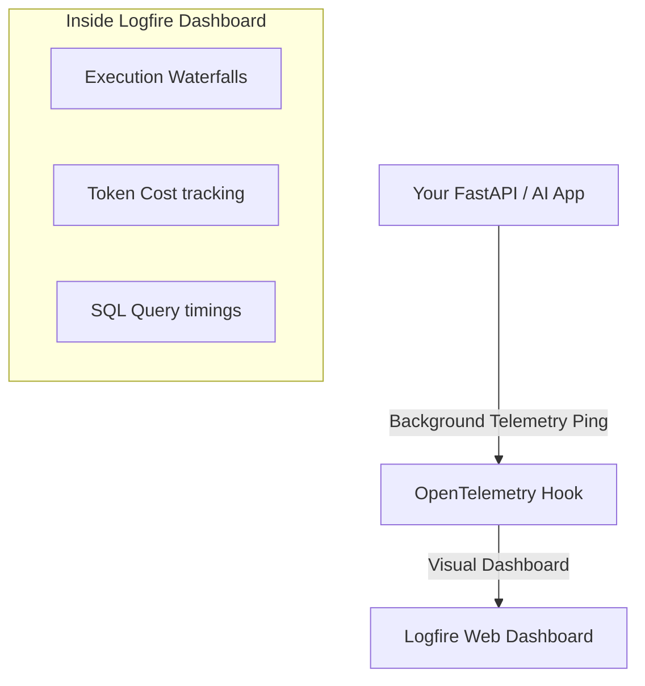

# Module 4: Observability & Telemetry

## What is Observability?
It is the concept of being able to "see inside" your code as it executes in real-time. 

In traditional code, you use `print()` statements. But when you are dealing with complex networks involving API calls to OpenAI, database queries, and async tools firing off simultaneously, basic `print()` statements become impossible to read.

## Why Do We Need Observability?
AI agents are "Black Boxes". 
If an Agent takes 45 seconds to respond to a user, how do you know if the lag was caused by:
- The LLM being slow?
- A web-scraping tool failing?
- A Pydantic schema validation retry?
Without observability, you are completely blind.

## Enter Logfire
**Logfire** is a stunning telemetry platform built explicitly by the Pydantic development team based on OpenTelemetry standards.

### Applications beyond Pydantic AI
A huge misconception is that Logfire is only for AI. This is false!
You can use Logfire to log **ANY** Python application:
- You can instrument a **FastAPI** web server to track exactly how many users hit `/login` and how long your SQL queries took.
- You can trace simple Python scripts using `@logfire.instrument`.
- You can monitor standard API calls.

When hooked into Pydantic AI, it generates beautiful "Waterfalls"—visual representations showing a timeline where the LLM started thinking, when it invoked a tool, how long the tool took, when it fetched the results, and exactly how many tokens were consumed for billing purposes.

