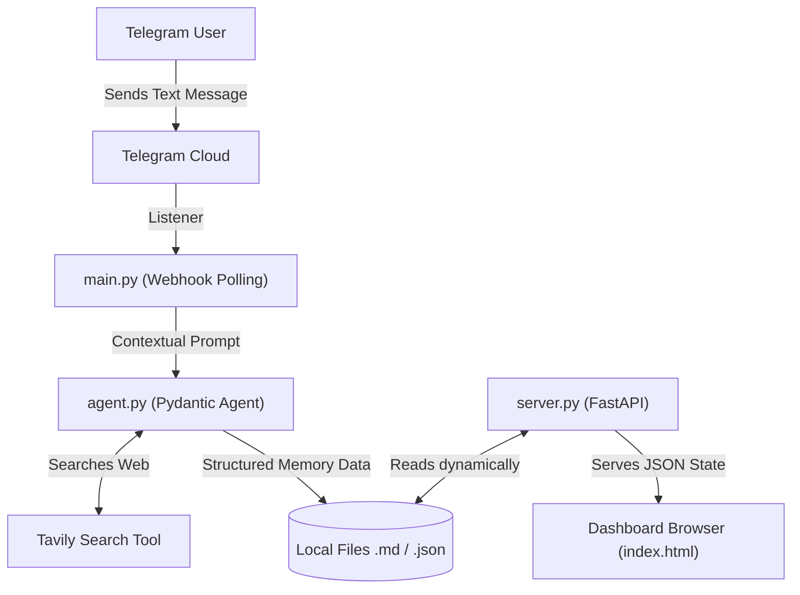

# Final Capstone: Project Alia

## Project Understanding & Use Case
**Alia** is a Telegram-integrated AI Bot with a real-time web dashboard. She doesn't just reply to messages; she possesses a persistent memory, a managed emotional state (Affection and Energy), a simulated background life (via automated hourly tasks), and the native capability to browse the web using Tavily.

### Real-World Usecase (Scaling this up)
While Alia acts as a conversational persona, the underlying architecture is extremely robust and can be easily repurposed for business automation:
- **Research Automation**: Instead of a "Teenage Girl" persona, the agent could be a "Financial Analyst". By leveraging the `tavily` web search tool and `diary.md` history, the agent can scrape daily market news and compile structured executive summaries asynchronously.
- **E-Commerce Order Bot**: By extending the `@agent.tool` decorators, the bot can securely hit an SQL database to check inventory and place orders for customers directly inside a Telegram or WhatsApp chat.

## Code Structure & Components

The application is cleanly decoupled into specific architecture pillars:

1. **`agent.py`**: The Brain. This file contains the strict Pydantic Output schema (`AliaResponse`) and the core instructions that mold the LLM into our desired persona.
2. **`tools.py`**: The Muscles. A collection of local functions that manage local database writing (persisting emotions into `.json` files, modifying `.md` diaries).
3. **`server.py`**: The Window. A lightweight FastAPI web server that visually broadcasts Alia's internal state to human observers.
4. **`main.py`**: The Nervous System. Combines the Telegram listener, the FastAPI background server, and the Logfire telemetry routing into a singular boot loop.

## What is FastAPI?
FastAPI is used in `server.py` to serve the Web Dashboard. It is an incredibly fast web framework that takes requests (like a user opening `localhost:8000`) and serves HTML or JSON data. In Project Alia, it provides a `/state` JSON endpoint, which the Glassmorphism frontend UI seamlessly polls every 1.5 seconds.

## System Architecture

