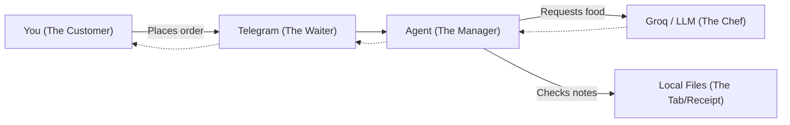

# 1. Terminologies and Concepts

Before we dive into the moving parts of **Agent Alia**, let's build a shared vocabulary. This project uses terms that might sound complex but are conceptually very simple!

## The Core Terminologies

1. **LLM (Large Language Model)**: The raw "brain" (in this case, Groq running LLaMA/Qwen). It takes text in and spits text out. It has no memory of its own.
2. **Pydantic AI (The Framework)**: The "manager" that controls the LLM. It forces the LLM to reply in strict formats (like asking you to fill out a form instead of letting you write freely).
3. **Agent**: An AI configured with a specific persona, goal, and tools. Alia is our agent here.
4. **State / Persistence**: The ability to *remember*. Since LLMs have no memory, we save her feelings and thoughts into local files (the `data/` folder). This is her "State."
5. **Polling / Listening Loop**: A piece of code that constantly asks, "Do I have a new message?" to keep the agent responsive to users.

---

## 🍽️ Relatable Example: The Restaurant Metaphor

Think of Alia's system like a high-end restaurant:

- **You** talk to the **Waiter (Telegram)**. 
- The Waiter passes your message to the **Manager (Pydantic Agent)**. 
- The Manager looks at the **Tab (Local Files / Memory)** to see if you are a good customer or if you still owe money (your affection score).
- The Manager tells the **Chef (Groq LLM)** what to cook based on your history.
- The Chef gives the meal back, and the Waiter serves it to you!
