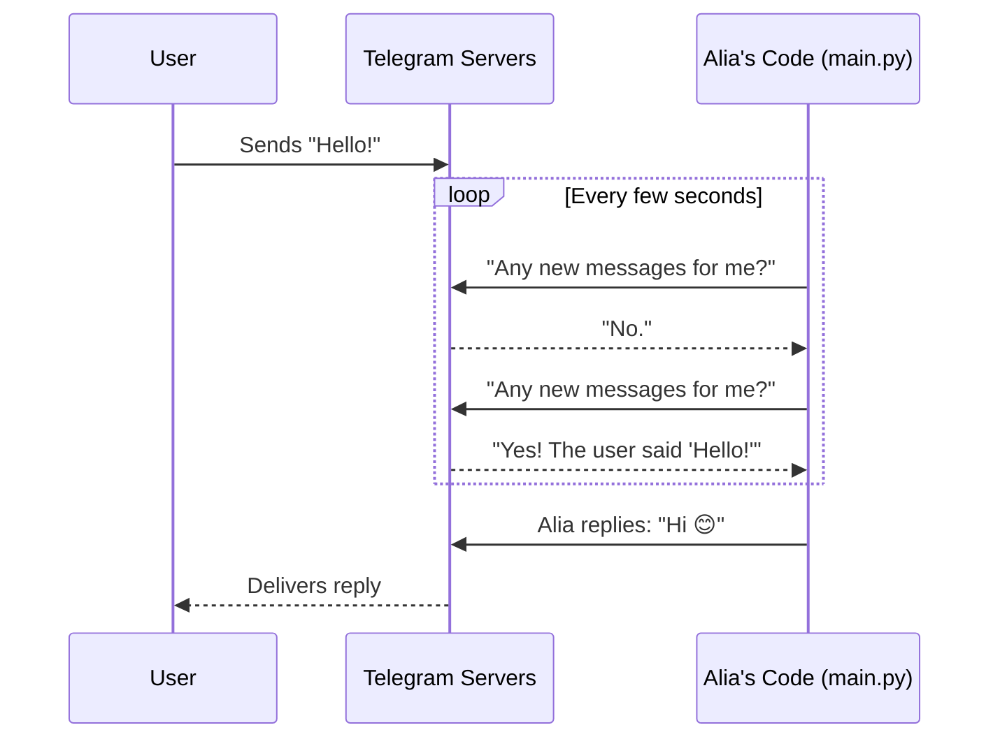

# 2. Telegram Bot Integration

Alia needs a way to text you. We use the **python-telegram-bot** library to handle this. But how does she know you sent a message?

## The Polling Loop

Alia's Telegram code runs using a system called **Long Polling**.

## 📬 Relatable Example: The Post Office

Imagine you are waiting for a very important letter. 
You don't just sit at home; you walk to the Post Office every 5 minutes and ask, "Is there mail for me?"
- If the clerk says "No," you walk back and wait.
- If the clerk says "Yes," you take the mail and read it.

This is exactly what the `ApplicationBuilder().run_polling()` line does in `main.py`! It constantly walks to the Telegram servers to check for your texts.

### Special Commands (Wake/Sleep)
Inside the bot, we also have an `if/else` gateway. If you text "Go to sleep," Alia flips a switch (`BOT_AWAKE = False`). Now, when she checks the mail at the Post Office, she just looks at it and tosses it away... until you write the exact words "Wake up".
