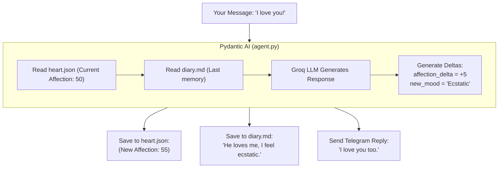

# 3. Agent and Memory (The `data` Folder)

The most unique part of Agent Alia is that she has an *inner life*. How do you give a computer "feelings"? 

You track numbers in a file!

## The `data/` Files Explained

1. **`heart.json`**: This stores numbers. `affection_level` (0-100), `energy` (0-100), and a string `mood` ("mellow", "ecstatic").
2. **`diary.md`**: She writes her secret thoughts here. When you text her, she reads her past thoughts to remember your history.
3. **`chat_log.json`**: A literal transcript of who said what.
4. **`twitter_sim.md`**: A folder where she posts her hourly poems.

## The Emotion Loop

Every time you message Alia, the Agent does the following "math" behind the scenes using Pydantic AI:

## 🎮 Relatable Example: A Video Game NPC

Think of an RPG like *The Sims* or *Skyrim*. 
If you attack a village guard, their `hostility` stat goes up, and they attack you. If you give them a gift, their `friendship` stat goes up. 

Alia works identically! Pydantic AI uses her `AliaResponse` schema to demand the LLM return a `delta` (a change in points). We then add those points to `heart.json` and she permanently remembers how you've treated her!
