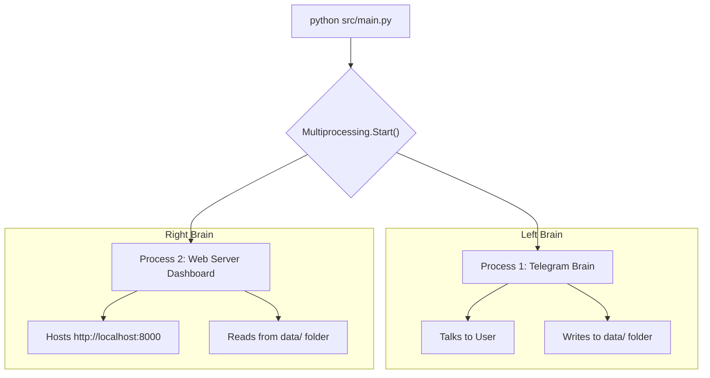

# 4. Putting It Together

We've talked about a Telegram Bot (which runs a continuous polling loop) and Memory Files. But wait... we also want a Web Dashboard to see her memory live. 

How does one Python script run a Telegram bot AND a Web Server at the same exact time without freezing?

## Multi-Processing

In Python, a standard script can only do one task at a time. If it is polling Telegram, it can't serve a web page. To fix this, `main.py` splits the program into **Two Processes**.

## 🧠 Relatable Example: Left Brain vs Right Brain

Imagine Alia as a human. 
- Her **Left Brain** (Process 1) is actively talking to you on the phone (Telegram) and writing down notes in her diary (data folder).
- Her **Right Brain** (Process 2) is holding up her diary so that anyone looking through the window (Web Dashboard) can read what she is writing.

They operate completely independently, but because they both share access to the same notebook (the `data/` folder), the Right Brain can show you exactly what the Left Brain is feeling in real-time!
