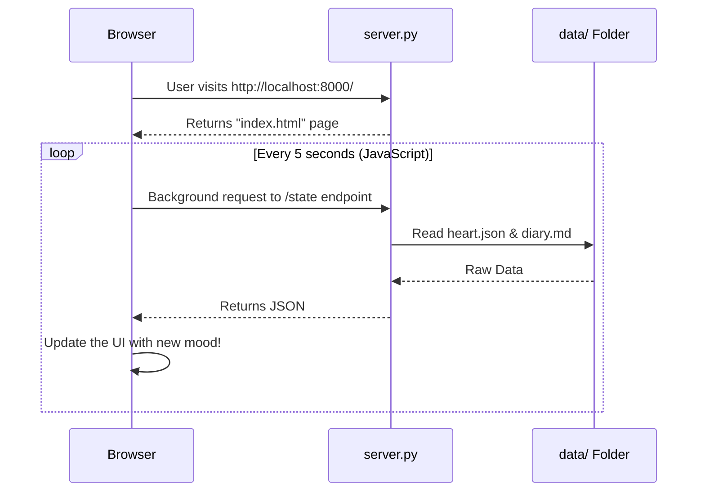

# 5. The FastAPI Dashboard (`server.py`)

So we have an Agent running in the background, updating its `heart.json` and `diary.md`. How do we actually see this information beautifully?

This is where **FastAPI**, a modern Python web framework, comes in. 

## Key Terminologies

1. **Web Server**: A program that listens for HTTP requests (like when you type `localhost:8000` in your browser) and returns a visual page.
2. **Endpoint or Route**: A specific URL path. For example, `/` gives you the homepage, while `/state` might give you raw data.
3. **JSONResponse**: Sending raw data (like a dictionary) across the web instead of a visual HTML page.
4. **Jinja2 Templates**: A way to take an HTML file and dynamically inject Python variables into it before sending it to the user.

## How the Dashboard Works

## 🔍 Relatable Example: A Museum Exhibit

Think of Alia's `data/` folder as a rare painting in a museum. 
You cannot touch the painting directly (you don't open the JSON files yourself). 

Instead, **FastAPI** acts as the glass display case and the museum curator. 
When you walk up to it (visit `localhost:8000`), the curator safely shows you exactly what the painting looks like at that exact moment without interrupting Alia's thoughts!
