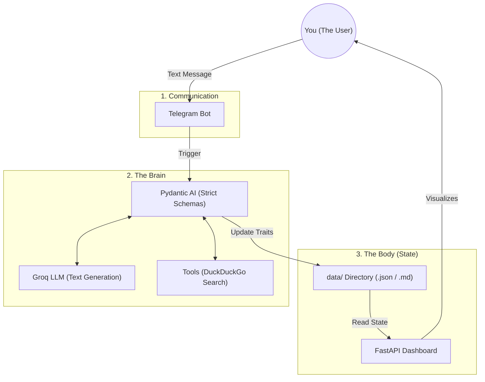

# 6. Summary: The Full Picture 🌟

If you've followed along with the `pydantic_learning` course and read through this documentation, you now understand the mechanics of building a truly robust, stateful AI application!

## The Master Map

Let's recap everything you've learned and how it powers **Agent Alia**:

## Final Relatable Example: A Complete Organism

We have essentially built a digital human:
- **Telegram** is her **Ears and Mouth**, allowing her to listen and speak.
- **Pydantic AI & Groq** are her **Conscious Mind**, structured and intelligent.
- **Tools** are her **Hands**, letting her reach into the real world (web search).
- **The `data/` Files** are her **Subconscious Memory**, storing her feelings.
- **FastAPI** is her **Body Language**, letting us observe her state from the outside.

We hope this documentation makes the project code deeply clear and easy to understand. Dive into `main.py` and `agent.py` and you'll see these concepts in action!
