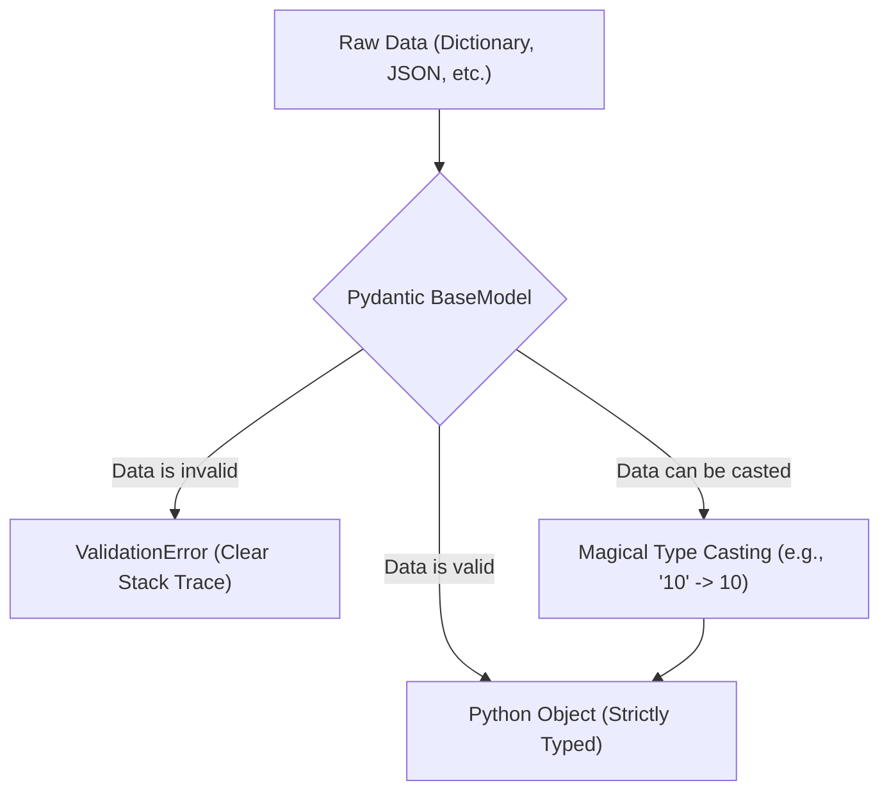

# Module 1: Pydantic Foundations

Welcome to the first module of the Pydantic AI Crash Course! Before diving into AI and Agents, it's crucial to understand what Pydantic is and why it's the foundation of modern Python data validation.

## The Pydantic Workflow



## What's inside?

- **1_what_is_pydantic.ipynb**: An introduction to Pydantic, demonstrating how it enforces types compared to standard Python.
- **2_validation_schemas.ipynb**: A deep dive into custom validation logic using `@field_validator` and building real-world schemas.

## Getting Started

Make sure you have installed the requirements from the root `requirements.txt`.
Then, simply open these notebooks in your IDE (like VS Code) or start your Jupyter server:
```bash
jupyter notebook
```
Navigate to these notebooks and run the cells!
