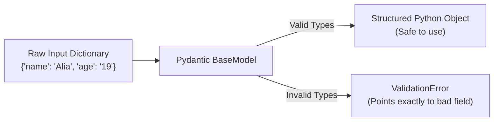

# Module 1: The Foundations of Pydantic

Before building intelligent Agents, one must master strict data validation. **Pydantic** is a library that uses standard Python type hints to ensure your data is exactly what you expect it to be. Instead of writing dozens of `if/else` statements, Pydantic handles it instantly.

## Core Concepts
- **Type Coercion**: If you ask for an `int` but receive `"10"`, Pydantic will smartly convert the string into an integer.
- **Strict Validation**: If you receive `"apple"` instead of an integer, Pydantic violently rejects it and throws a detailed `ValidationError`.
- **Schemas**: By inheriting from `BaseModel`, you define a strict "schema" (a blueprint) for what an object must look like.

## The Validation Flow

## Key Methods Used
1. **`BaseModel`**: The foundation class. Any class inheriting from this magically gains validation powers.
2. **`@field_validator`**: A decorator that allows you to write custom python logic to validate specific fields.
