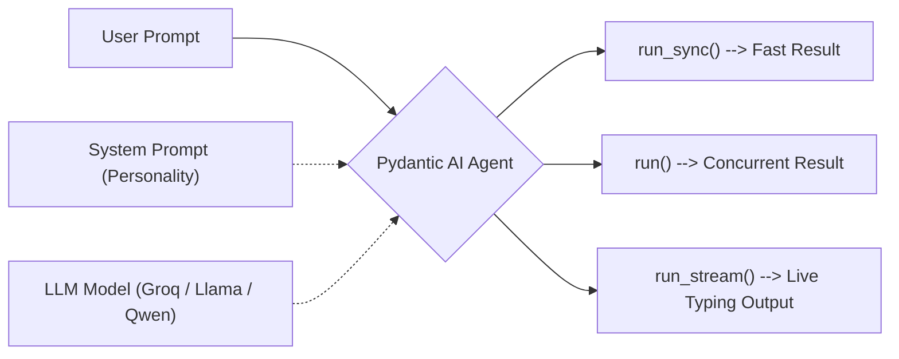

# Module 2: Pydantic AI Intro

Now that you know how Pydantic models structure data, let's explore **Pydantic AI**. 

Pydantic AI bridges the gap between Large Language Models (LLMs) and standard Python code by letting you easily define Agents that spit out guaranteed, structured data. 

## The Agent Architecture



## What's inside?

- **1_your_first_agent.ipynb**: Set up your very first multi-purpose agents. We will contrast a basic agent against an agent configured with an intricate system prompt.
- **2_running_agents.ipynb**: Demonstrates the three different methods for interacting with an agent: synchronous (`run_sync`), asynchronous (`run`), and streaming (`run_stream`), each tied to a realistic use case.

## Prerequisite: Groq API Key
Ensure you have a `.env` file in the root directory (or your current working directory) with your Groq API key:
```env
GROQ_API_KEY=your_key_here
```
