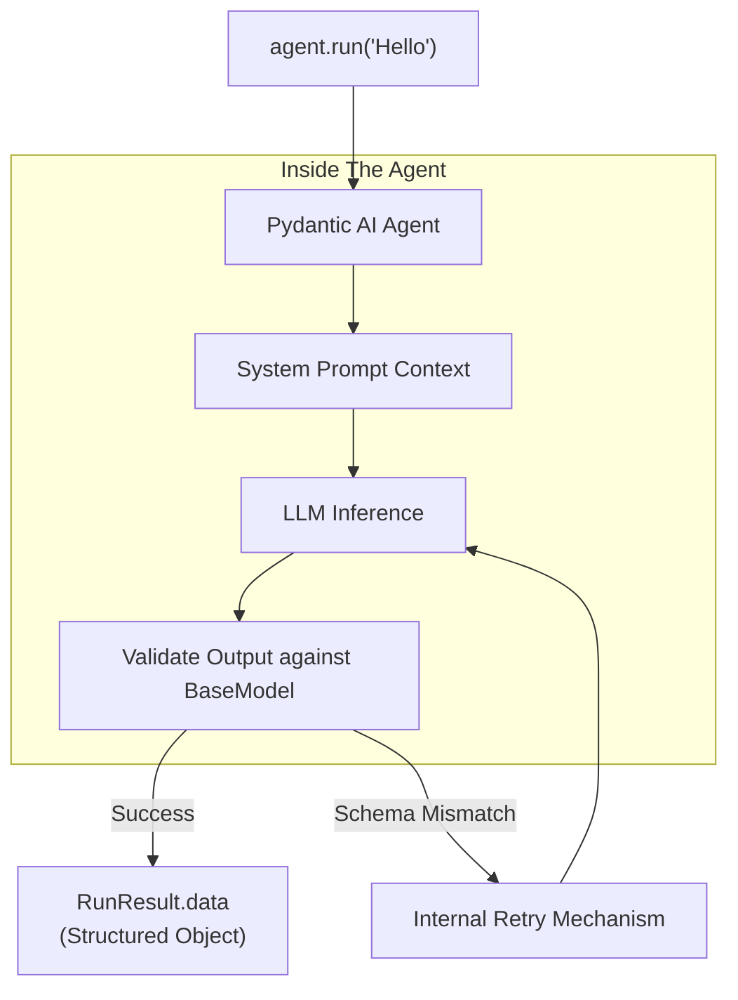

# Module 2: The Agent Structure

This module transitions from basic data schemas into the core construct of Pydantic AI: The **Agent**.

## Core Concepts
- **The Agent Object**: A single, self-contained unit combining your language model choice, its persona, and its required output schema.
- **System Prompts**: The absolute instructions guiding the Agent's behavior mapping.
- **Run Sequences**: An Agent isn't alive until you invoke a `.run()` command, which spins up a one-shot execution across the LLM.

## The Execution Flow

## Key Methods Used
1. **`Agent()`**: Initialize your bot with a target Model (like `groq:llama-3.3`).
2. **`agent.run_sync()`**: Executes a synchronous, blocking prompt call.
3. **`agent.run()`**: The async version, built to scale across massive concurrent applications.
