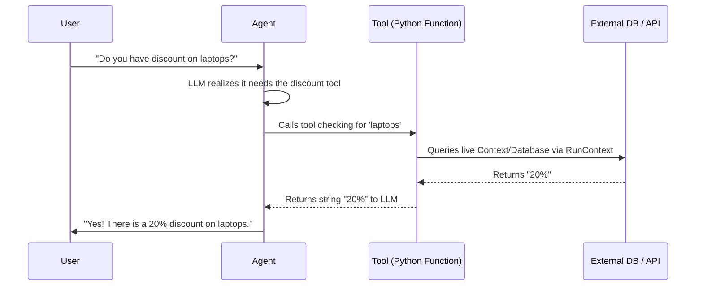

# Module 3: Tools & Integrations

Welcome to the final module! Here we explore **Tools** a.k.a Function Calling. 

Tools allow agents to escape their training data cutoff. By giving an agent a tool, you allow it to fetch live search results, query a database, or even execute local commands automatically.

## How Tools Work under the hood

## What's inside?

- **1_custom_tools.ipynb**: We explore the difference between simple tools using `@agent.tool_plain` and contextual tools that inject secure database mocks via `@agent.tool` and `RunContext`.
- **2_integrations_and_langchain.ipynb**: Sometimes you don't want to re-invent the wheel. The LangChain community has hundreds of pre-built tools. We'll show you how to securely wrap the **Wikipedia Tool** right into Pydantic AI.
