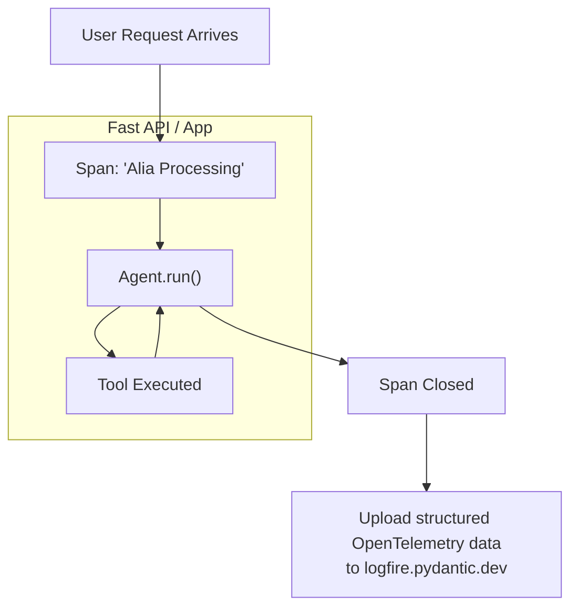

# Module 4: Agent Observability (Logfire)

When an Agent operates with tools, system prompts, and multiple LLM back-and-forths, the code can look like a "Black Box". If an agent hallucinates or crashes, you need to understand *why*. **Pydantic Logfire** solves this by generating a visual telemetry trace.

## Core Concepts
- **Instrumentation**: "Hooking" into libraries (like Pydantic, FastAPI, or raw Python) so their behaviors log metrics natively.
- **Spans**: Timing blocks representing the start and end of a specific action. You can nest spans within spans.
- **Waterfalls**: A cascading timeline view showing exactly how long an LLM took to think, what tool it called, and how many tokens it consumed.

## The Telemetry Flow

## Key Methods Used
1. **`logfire.configure()`**: Boots up the telemetry engine and validates your environment API Key.
2. **`logfire.instrument_pydantic_ai()`**: The single line that magically hooks deep into the Agent layer, stripping apart token metrics, failures, internal retries, and nested tool calls.
3. **`with logfire.span("name"):`**: A manual context manager. Any python code running inside this block gets beautifully timed and logged independently on your dashboard.
