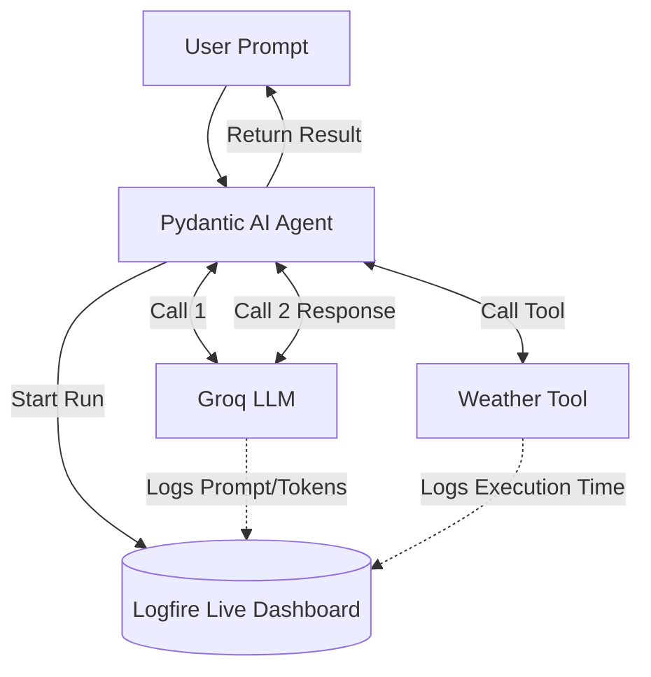

# Module 4: Agent Observability (Logfire)

When working with Large Language Models, you often face the "Black Box" problem. 
- *What exact prompt was sent?* 
- *How long did the tool take to run?* 
- *Did the LLM fail before fixing itself?*

**Logfire** is an observability platform built strictly for Python and Pydantic. It allows you to peer deep into the mind of your Pydantic AI Agents as they execute.

## The Observability Flow



## What's inside?

- **1_basic_observability.ipynb**: Shows how simple it is to turn on Logfire tracing for a single-shot LLM run.
- **2_tool_call_tracing.ipynb**: Demonstrates the true power of observability. Watch how Logfire creates a "waterfall" trace visualizing the LLM stopping, calling a Python tool, waiting, and resuming.

## Prerequisite: Logfire Token
1. Go to [logfire.pydantic.dev](https://logfire.pydantic.dev/) and create a free account.
2. Initialize a project to get an API key.
3. Ensure you have added the key to your `.env` file:
```env
LOGFIRE_API_KEY=your_logfire_key
```
